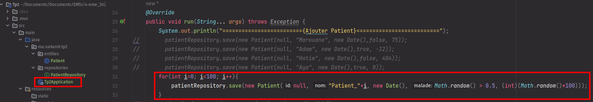

# Activite Pratique N2

> Creation d'un projet spring boot avec les dependances: `Spring Data`, `H2`, `Spring Web`, `Lombock`.

## 1-  Creation d'une entite JPA Patient

## 2- Creation d'une interface PatientRepository basee sur Spring Data

## 3- Configuration de l'unite de persistance => `application.properties`

## 4- Tester quelques operations de gestion des patients:
### 4.1- Ajouter des Patients

### 4.2- Afficher tous les Patients

### 4.3- Chercher les Patients
> Chercher les patients malade

### 4.4- Modifier un Patient

### 4.5- Supprimer un Patient
